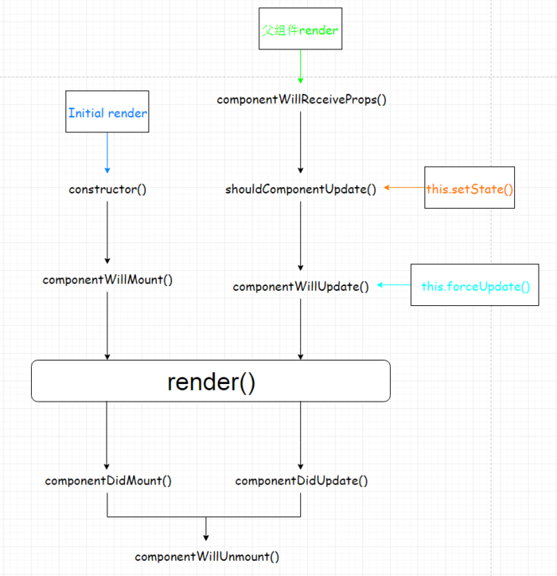

# React

### setup
- webpack
- babel

```sh
npm install --save--dev babel-loader babel-core 
npm install babel-preset-es2015 babel-preset-react
```

```js
// .babelrc
{
    "presets":[
        "es2015", "react"
    ]
}
```
- react

```sh
npm install react react-dom
```

### 原理

#### jsx
- JSX is a shortcut for using the React.createElement() API
- Each tag, like ``<div />``, is transformed into a call to React.createElement(). Any attributes become props of the instantiated component.

```js
// before
const a = <div />

const b = (
  <div
    foo='hello'
    bar={baz}>
    <span>42</span>
  </div>
)
// after
var a = React.createElement('div', null);

var b = React.createElement(
  'div',
  {
    foo: 'hello',
    bar: baz },
  React.createElement(
    'span',
    null,
    '42'
  )
);
```

### 基礎

#### react and react.dom
- react contains the APIs for creating components
- react-dom contains the APIs for rendering to the browser DOM
- we generally must import React even though we don't explicitly use it in our code - this is because our **JSX transformed behind the scenes to React.createElement.**

#### 常用API
- React.Component
	- React components are the building blocks of a React app. Components are classes that we instantiate using JSX syntax
	- normal tag in html will be processed automatically in react
- Stateless Functional Components (SFCs)
	- 不需要有state, 不需要對state操作, 就直接return jsx
	
	```jsx
	const app = (props) => <div>Hello {props.name}</div>;
	```
- this.props
	- defaultProps
		- default props的值
	```jsx
	CustomButton.defaultProps = {
	  color: 'blue'
	};
	```
	- propTypes
		- ``npm prop-types``
		- 強制檢查prop的type
- this.state

#### Life Cycle

**Mounting Cycle**

- constructor(object props):
	- component剛被創建, 接受props的參數, 可以在裡面設置this.state的初始值
- componentWillMount() 
	- 只在被呼叫一次, 呼叫時機是在第一次render前, 屆時, 還沒有native UI
	- **可調用setState**, 但不會隨即re-render
- render() -> react element
	- render native UI
- componentDidMount()
	- 在render後立即執行
	- 可調用ref
	- **可調用setState**, 會隨即re-render

**Update Cycle**

- componentWillReceiveProps(nextProps)
	- 在接受到新的props後觸發
	- 如果你需要在props變化之後來更新state, 可能需要比較this, next props, 再使用**setState**來改變state

- shouldComponentUpdate(nextProps, nextState)
	- 接受到新的props, state時觸發
	- 在接收新的props或state时确定是否发生重新渲染，默认情况返回true，表示会发生重新渲染, 若為false, 則不會執行以下流程
- componentWillUpdate(nextProps, nextState)
	- 在props或state发生改变或者shouldComponentUpdate(nextProps, nextState)触发后, 在render()之前
-  componentDidUpdate(prevProps, prevState)
	- 在发生更新或componentWillUpdate(nextProps, nextState)后
	- 使用这个方法可以对组件中的DOM进行操作
- componentWillUnmount()
	- 在组件卸载(unmounted)或销毁(destroyed)之前

**更新流程**

1. 组件初始化
	- 原因
		- 组件第一次建立
	- 触发
		- componentWillMount -> render -> componentDidMount
2. props change
	- 原因
		- props发生改变
	- 触发
		- componentWillReceiveProps -> shouldComponentUpdate -> componentWillUpdate -> render -> componentDidUpdate
3. state change
	- 原因
		- this.setState()使state发生改变
	- 触发
		- shoudlComponentUpdate -> componentWillUpdate -> render-> componentDidUpdate
		
**圖示**
<p align="center">  </p>

#### react UI

- 靜態UI, no-js-animation: styled-component
- throw-away js-animation: css-animation
- complex js-animation: react-motion

#### Conditional Rendering

```jsx
// 1. Rendering with &&
{subtitle && (
  <h2 style={styles.subtitle}>{subtitle}</h2>
)}
// 2. Rendering with ternary ?
{subtitle ? (
  <h2 style={styles.subtitle}>{subtitle}</h2>
) : (
  <h3 style={styles.empty}>No subtitle</h3>
)}
// 3. Rendering with if/else
if (error) {
  content = 'Error'
} else if (loading) {
  content = (
    <h3 style={styles.empty}>Loading...</h3>
  )
}
// 4. IIFE
``` 

#### Refs and the DOM
React components have a special ref prop. You can pass a callback function as the ref, which will **get called with the component instance after the initial render**. You can save the reference for use within React lifecycle methods.

```jsx
ref={(ref) => this.containerNode = ref}
```